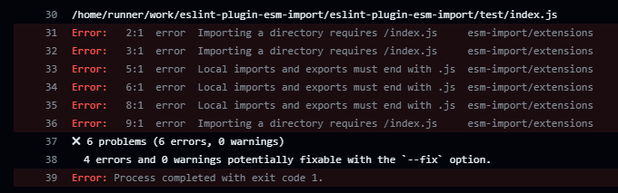

# eslint-plugin-esm-import

An ESLint plugin which enforces explicit `.js` extensions in local imports.

The purpose of this plugin is to
  - help with the initial migration of a common.js project to ESM, by leveraging the `eslint --fix` feature:
    - `import x from './x-file'` -> `import x from './x-file.js'`
    - `import y from './y-folder'` -> `import y from './y-folder/index.js'`
  - enforce explicit `.js` extensions on all relevant imports during development

__NOTE__ This plugin will be usefult to you only if you've been writing ESM-style imports in an otherwise common.js project, using babel and/or tsc to transpile it, so you are now stuck with a large number of file imports which don't have extensions and folder imports which don't have index files and thus do not conform to the ESM spec.   
This was a fairly standard practice ever since ES6 (ES2015) came out.

## Key features
  - leverages existing import resolvers from the ESLint configuration (e.g. `node`, `webpack`, `typescript`)
  - honors the convention of importing `.ts` and `.tsx` files as `.js`
  - configurable list of ignored extensions (see [Configure](#configure))
  - configurable list of _index files_  (see [Configure](#configure))


Inspired by [eslint-plugin-require-extensions](https://github.com/solana-labs/eslint-plugin-require-extensions), which only recognizes imports which start with `./`, meaning it [doesn't know](https://github.com/solana-labs/eslint-plugin-require-extensions/issues/10) how to handle imports which use resolver aliases (`resolve.alias` from _Webpack_ conf or `compilerOptions.paths` from `tsconfig` and so on), which are usually the vast majority of imports in complex projects.

## Install

1. Install
```shell
npm install --save-dev eslint-plugin-esm-import
```

2. Edit `.eslintrc`
```json
{
    "extends": ["plugin:esm-import/recommended"]
}
```
Restart ESLint server to force conf reload in your IDE (in VSCode: `Help > Show all commands > Restart ESLint server`).

3. Code
```js
// source.js
import RelativeFile from '../../shared/components/RelativeFile';
import AliasedFile from 'Components/AliasedFile';   // provided there's a Components alias
import AliasedFolder from 'Modules/aliased-folder'; // provided there's a Modules alias
```

4. Lint

```shell
> ./node_modules/.bin/eslint ./src/source.js

source.js
  1:1  error  Local imports and exports must end with .js   esm-import/extensions
  1:1  error  Local imports and exports must end with .js   esm-import/extensions
  1:1  error  Importing a directory requires /index.js      esm-import/extensions

✖ 3 problems (3 errors, 0 warnings)
  3 errors and 0 warnings potentially fixable with the `--fix` option.
```
The purpose of the GH action is to run eslint in order to show the plugin in action:


5. Fix

```shell
> ./node_modules/.bin/eslint --fix ./src/source.js
```
```js
// source.js
import RelativeFile from '../../components/RelativeFile.js';
import AliasedFile from 'components/AliasedFile.js';
import AliasedFolder from 'Modules/aliased-folder/index.js';
```

## Configure
The plugin allows you to configure:
 - the list of ignored extensions, so this plugin can ignore imports which end with any of those extensions (defaults to `[".js", ".cjs", ".json", ".css", ".scss"]`)
 - the list of _index files_, in order to recognize that a folder got resolved to an index file and thus knows that the fix is to append `/index.js`, not `.js` (defaults to `["index.js", "index.jsx", "index.ts", "index.tsx"]`)


```json
// .eslintrc example settings
"settings": {
    "esm-import": {
      "ignore": [".js", ".cjs", ".json", ".css", ".scss", ".svg", ".png", ".gif", ".mp3"],
      "index": ["index.js", "index.jsx", "index.ts", "index.tsx"]
    }
  },
```

### TypeScript
Make sure you define extension aliases in your Webpack configuration, otherwise eslint won't be able to resolve imports of TS files from JS as `.js`:
```js
  resolve: {
    extensionAlias: {
      '.js': [
        '.ts',
        '.tsx',
        '.d.ts',
      ],
    },
  },
```

### Background info

`eslint-plugin-import` [has no plans](https://github.com/import-js/eslint-plugin-import/issues/2111) to treat `ts` imports as `js`.  
`TypeScript` has no plans to [transform](https://github.com/microsoft/TypeScript/issues/16577) nor [enforce](https://github.com/microsoft/TypeScript/issues/42813) extensions.
